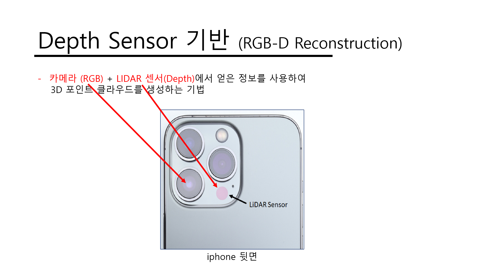
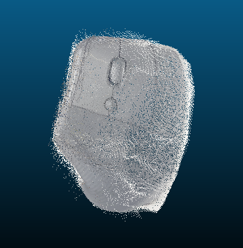
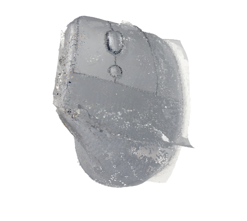

# 3D-Reconstruction-Using-iPhone-Camera-and-LiDAR

### iPhone Pro 시리즈에 탑재된 RGB Camera와 ToF 방식의 LiDAR 센서를 활용하여 물체를 3D Model로 변환 가능한 기술을 구현하는 프로젝트입니다.

- 현재 진행 중인 프로젝트라 코드는 업로드하지 않았습니다.

- 현재 진행 상황 : 결과물 퀄리티 향상 및 파이프 라인 연동

## 3D Reconstruction Project 간단 설명

## 결과 Example

